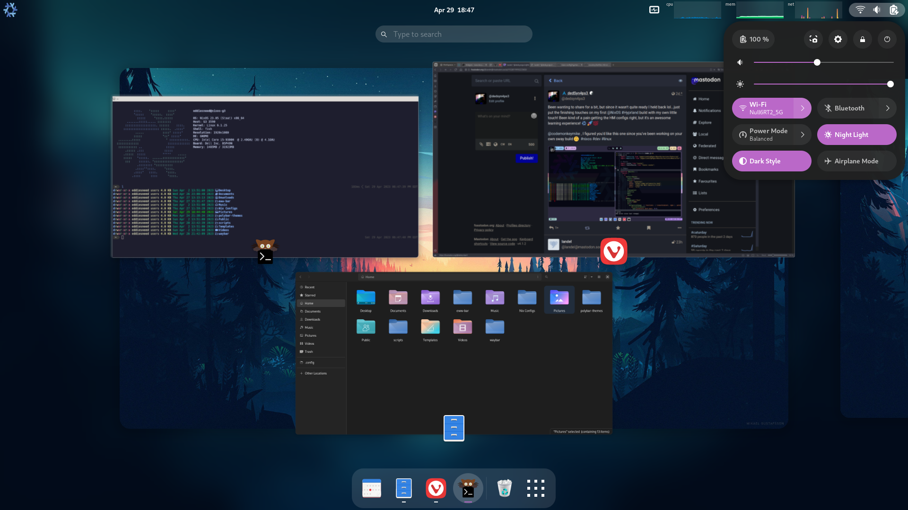
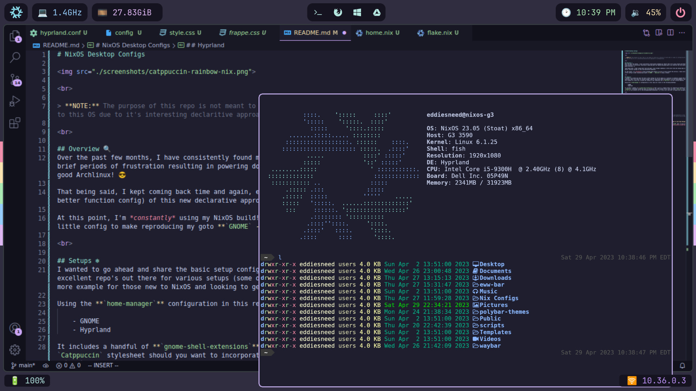

# NixOS Desktop Configs

 

> **NOTE:** The purpose of this repo is not meant to serve as a source of truth when it comes to configuring NixOS. I've found myself coming back to this OS due to it's interesting declaritive approach to configuration

 

## Overview 🔍
Over the past few months, I have consistently found myself grabbing my rebuilt Dell G3 to play around with NixOS. At first, it started off with brief periods of frustration resulting in powering down the laptop and going back to my favorite two Arch builds...what can I say, I 💙 me some good Archlinux! 😎

That being said, I kept coming back time and again, each attempt spending a little more time and coming away with a better understanding (and better function config) of this new declarative approach.

At this point, I'm *constantly* using my NixOS build! While I've yet to truly scratch the service, I have still managed to put together a decent little config to make reproducing my goto **`GNOME` - `Hyprland`** setup a breeze!

 

## Setup ❄
I wanted to go ahead and share the basic setup configs for my G3 laptop as I continue to gradually expand and build upon it. There are dozens of excellent repo's out there for various setups (some of which have been instrumental to my own development), and I hope this can serve to be one more example for those new to NixOS and looking to get something like **`Hyprland`** up and running smoothly.

Using the **`home-manager`** configuration in this repo will result in the following desktops:

    - GNOME
    - Hyprland

It includes a handful of **`gnome-shell-extensions`** that I use on a regular basis for enhancing my desktop experience, as well as an additional `Catppuccin` stylesheet should you want to incorporate any other pastel colors into your main `style.css` file. Remember, even though the **`nix`** file installs all of the aforementioned extensions, it's still up to the user to enable and configure them to their liking! 😁

 

## GNOME
---------

 

 

## Hyprland
------------

 

 

> The **`Hyprland`** config is set to utilize **`Waybar`** for displaying various metrics and shortcuts on the top and bottom of the screen. It expects the Waybar directory to be located in your user's **`$HOME`** directory, but that of course can be changed...

 

## Final Notes 🗒
It should go without saying that in order to use the configs in this repo as is, **you need to have Home Manager and Nix Flakes enabled**.

This is a very straightforward process and is detailed quite extensively in the various `NixOS` docs. If you are in need of a great resource for using `Home-Manager` and `Flakes`, definitely check out **[The Manual](https://nix-community.github.io/home-manager/index.html#sec-install-standalone)** 🤘